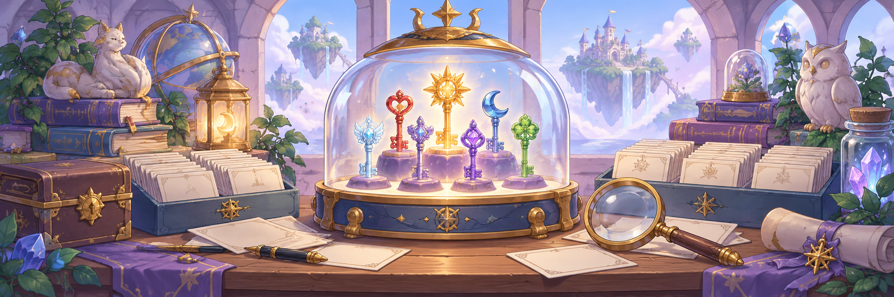

<!-- project-centered:start -->

<h1 align="center">Key Quest Recovery Project</h1>

<!-- project-header:start -->

<!-- project-header:end -->

<!-- project-badges:start -->

  

<!-- project-badges:end -->

<!-- project-live-badges:start -->

  

<!-- project-live-badges:end -->

<!-- project-index:start -->

<h3 align="center">✦ Explore this project</h3>
<table align="center"><tbody><tr><td align="center"><a href="#readme-overview"><strong>Overview</strong></a></td><td align="center"><a href="#readme-milestone-0-proof-of-life"><strong>Milestone 0 — Proof of life</strong></a></td></tr><tr><td align="center"><a href="#readme-safety-boundary"><strong>Safety boundary</strong></a></td><td align="center"><a href="#readme-run-locally"><strong>Run locally</strong></a></td></tr><tr><td align="center"><a href="#readme-deploy-to-cpanel-keyquest-deadsignaldb-com"><strong>Deploy to cPanel / keyquest.deadsignaldb.com</strong></a></td><td align="center"><a href="#readme-recovery-classifications"><strong>Recovery classifications</strong></a></td></tr><tr><td align="center" colspan="2"><a href="#readme-project-rule"><strong>Project rule</strong></a></td></tr></tbody></table>
<h4 align="center">Project shortcuts</h4>
<table align="center"><tbody><tr><td align="center"><a href="docs/RECOVERY_LEDGER.md"><strong>RECOVERY LEDGER</strong></a></td><td align="center"><a href="index.html"><strong>index.html</strong></a></td></tr><tr><td align="center"><a href="proxy.php"><strong>proxy.php</strong></a></td><td align="center"><a href="server.mjs"><strong>server.mjs</strong></a></td></tr></tbody></table>
<!-- project-index:end -->

<h2 align="center">Overview</h2>

A technical preservation and recovery effort focused on determining how much of the original Neopets Key Quest client still survives and what is required to make it playable in a modern browser.

<a href="#readme-index">↑ Back to index</a>

## Milestone 0 — Proof of life

The first target is intentionally narrow: fetch the historical Key Quest client from Neopets' public CDN at runtime and attempt to boot it in current Chrome through Ruffle.

Historical client URL:

<table align="center"><tbody><tr><td align="left"><pre><code>https://images.neopets.com/keyquest/game/kq2/KeyQuest.swf?v=32</code></pre></td></tr></tbody></table>

This repository does **not** bundle Neopets SWFs, artwork, audio, account credentials, or other proprietary assets.

<a href="#readme-index">↑ Back to index</a>

## Safety boundary

The recovery harness is deliberately read-only:

<table align="center"><tbody><tr><td align="center">only <code>GET</code> and <code>HEAD</code> are proxied;</td></tr><tr><td align="center">only <code>https://images.neopets.com/</code> is permitted;</td></tr><tr><td align="center">no Neopets login cookies are sent;</td></tr><tr><td align="center">no score submission, Neopoints award, item award, prize redemption, or account modification exists;</td></tr><tr><td align="center">network observations are written to a recovery ledger/log.</td></tr></tbody></table>

The point is to make the client run far enough to identify what survives, what is missing, and what backend behavior must be reconstructed.

<a href="#readme-index">↑ Back to index</a>

## Run locally

Requires Node.js 18+ and a current Chrome/Edge build.

<table align="center"><tbody><tr><td align="left"><pre><code>npm start</code></pre></td></tr></tbody></table>

Then open:

<table align="center"><tbody><tr><td align="left"><pre><code>http://127.0.0.1:8787</code></pre></td></tr></tbody></table>

Click **Boot original client**.

<a href="#readme-index">↑ Back to index</a>

## Deploy to cPanel / keyquest.deadsignaldb.com

The same frontend can run on ordinary Apache/PHP hosting. No Node application is required for the first hosted proof.

The document root for `keyquest.deadsignaldb.com` should contain the contents of this repository, especially:

<table align="center"><tbody><tr><td align="left"><pre><code>.htaccess
index.html
proxy.php</code></pre></td></tr></tbody></table>

Apache rewrites requests such as:

<table align="center"><tbody><tr><td align="left"><pre><code>/neo/keyquest/game/kq2/KeyQuest.swf?v=32</code></pre></td></tr></tbody></table>

to the read-only PHP proxy. The proxy then fetches the matching public resource from `images.neopets.com` without forwarding login cookies or allowing write methods.

### Preferred deployment

If cPanel offers **Git Version Control**, clone:

<table align="center"><tbody><tr><td align="left"><pre><code>https://github.com/raiinman/keyquest.git</code></pre></td></tr></tbody></table>

into the document root assigned to `keyquest.deadsignaldb.com`. Future updates can then be deployed with a Git pull instead of manual FTP uploads.

If Git Version Control is unavailable, upload the repository files to the subdomain document root with SFTP/FTP or cPanel File Manager.

### Hosting requirements

<table align="center"><tbody><tr><td align="center">Apache <code>mod_rewrite</code> enabled</td></tr><tr><td align="center">PHP 7.4+ recommended</td></tr><tr><td align="center">PHP cURL extension enabled</td></tr><tr><td align="center">HTTPS enabled for the subdomain</td></tr></tbody></table>

<a href="#readme-index">↑ Back to index</a>

## Recovery classifications

Every discovered dependency should ultimately be classified as one of:

<table align="center"><tbody><tr><td align="center"><code>SURVIVES</code></td></tr><tr><td align="center"><code>MISSING</code></td></tr><tr><td align="center"><code>BACKEND_REQUIRED</code></td></tr><tr><td align="center"><code>RUFFLE_INCOMPATIBILITY</code></td></tr><tr><td align="center"><code>UNKNOWN</code></td></tr></tbody></table>

See `docs/RECOVERY_LEDGER.md` for the evidence ledger.

<a href="#readme-index">↑ Back to index</a>

## Project rule

Do not add write-capable Neopets production integration. A future official integration should require explicit Neopets authorization and separate production credentials.

<a href="#readme-index">↑ Back to index</a> · <a href="#readme-top">Back to top ↑</a>

<!-- project-centered:end -->
